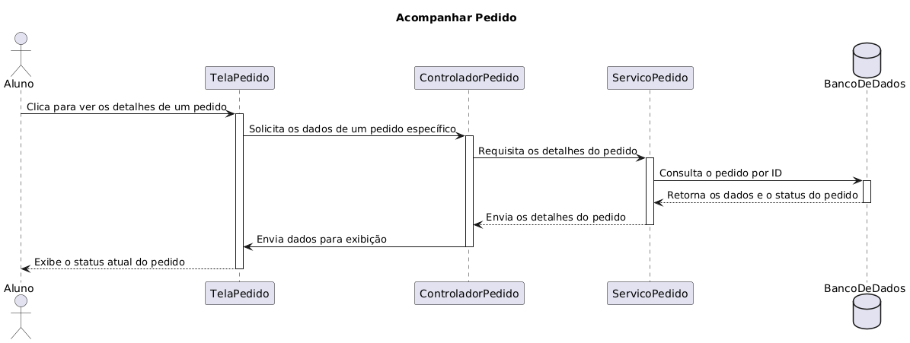
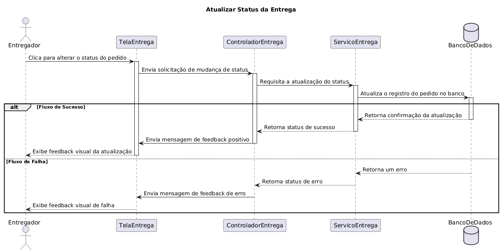
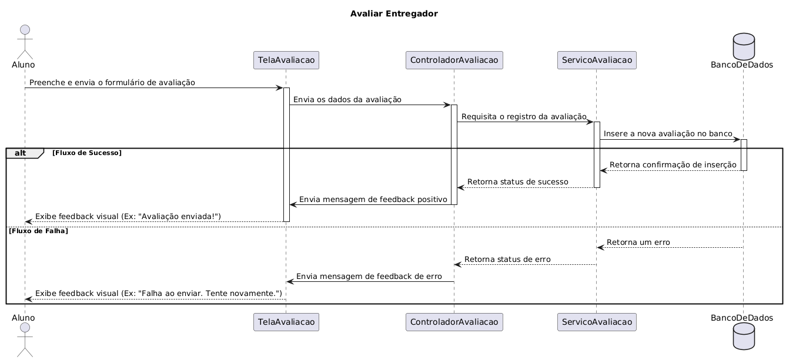
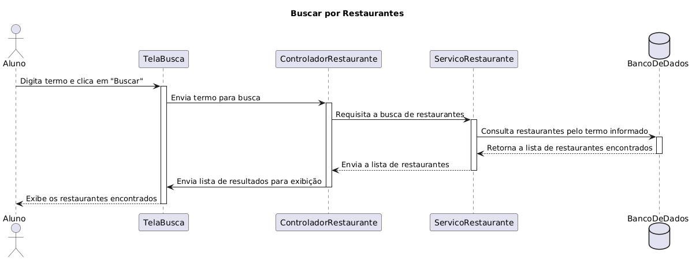
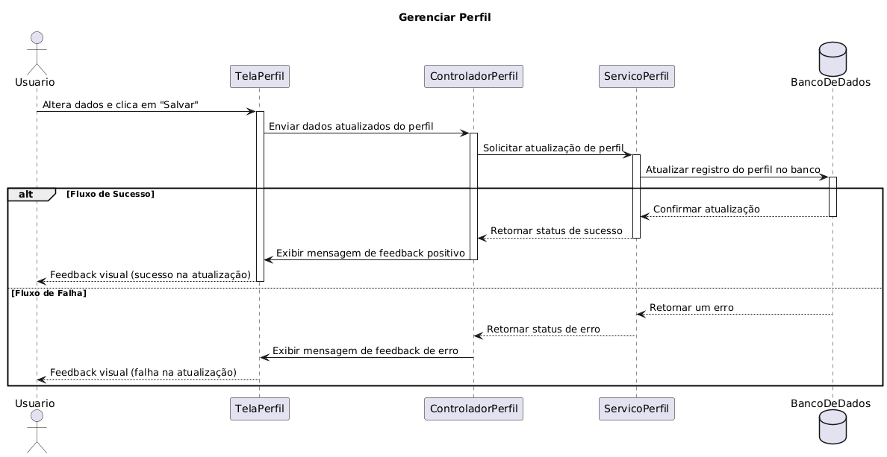
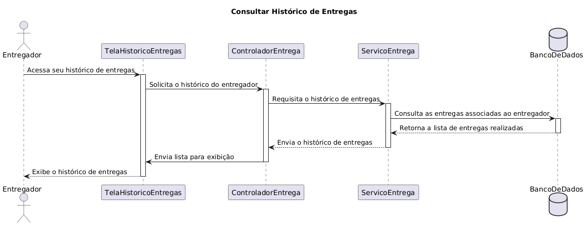
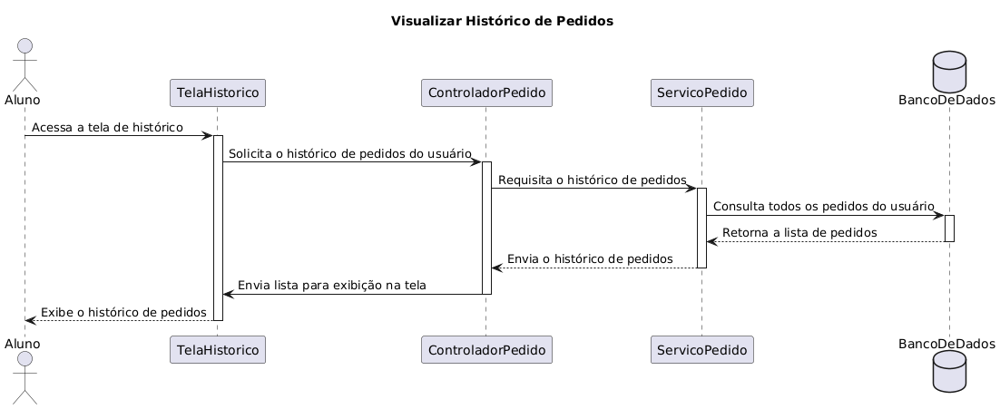
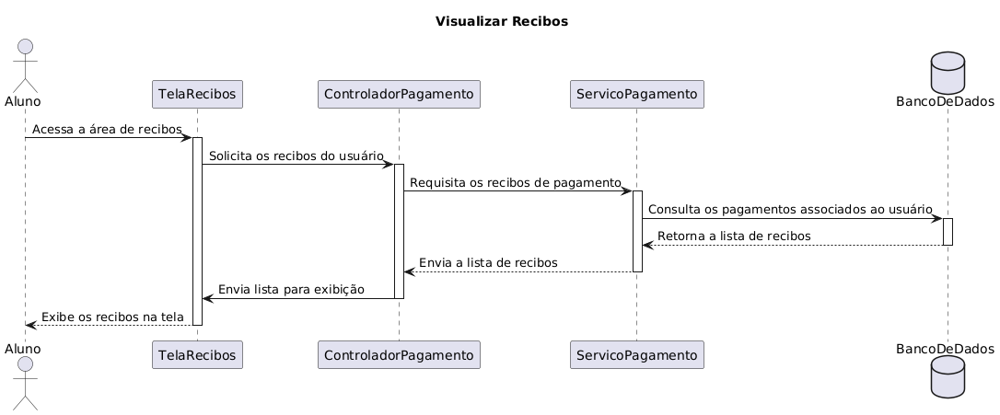

# 4.1.2. Visualização do Processo

## Introdução

Segundo o site GeeksForGeeks, a visualização de processo lida com os aspectos dinâmicos do sistema, descreve processos de sistema e como eles se comunicam e enfatiza o comportamento do sistema durante sua execução, descrevendo diferentes atividades de sistema. Diagramas de sequência e de atividades são utilizados para a visualização de processo.

## Visão Geral

O PodePedirFCTE é um sistema que permite que os usuários, estudantes da UnB campus Gama, possam fazer pedidos de delivery para estabelecimentos próximos à faculdade. Dessa forma, os alunos possuem um novo conjunto de opções para seus almoços e lanches além de fomentar o comércio local.

## Diagramas

Durante o desenvolvimento da [Entrega 2](https://unbarqdsw2025-2-turma01.github.io/2025.2-T01-G7_PodePedirFCTE_Entrega_02/#/) foram desenvolvidos alguns diagramas. Dentre esses diagramas, os que se encaixam na Visualização de Processo são os seguintes:

- [Diagrama de Atividades](https://unbarqdsw2025-2-turma01.github.io/2025.2-T01-G7_PodePedirFCTE_Entrega_02/#/Modelagem/ModelagemDinamica/DiagramaDeAtividades)
- [Diagrama de Sequência](https://unbarqdsw2025-2-turma01.github.io/2025.2-T01-G7_PodePedirFCTE_Entrega_02/#/Modelagem/ModelagemDinamica/DiagramaDeSequencia)

### Diagrama de Atividades

O Diagrama de Atividades é utilizado pra modelar aspectos dinâmicos de um sistema e tem como foco o fluxo de controle de uma atividade para a outra.

Dentro do projeto PodePedirFCTE, foram realizados 3 Diagramas de Atividades, cada um com foco em um dos principais atores do sistema: Cliente, Fornecedor e Entregador.

#### Legenda

Figura 1: Diagrama de Atividade Legenda dos ícones utilizados.

Fonte: Ana Joyce e Gabriela (2025)

#### Fluxo executado pelo o fornecedor

Figura 2: Diagrama de Atividades: Fornecedores.

Fonte: Ana Joyce e Gabriela (2025)

#### Fluxo executado pelo o entregador

Figura 3: Diagrama de Atividades: Entregadores.

Fonte: Ana Joyce e Gabriela (2025)

#### Fluxo executado pelo o cliente

Figura 4: Diagrama de Atividades: Cliente.

Fonte: Ana Joyce e Gabriela (2025)

Mais detalhes referentes aos diagramas de atividades construídos podem ser encontrados na documentação deles realizada na entrega 2, no link a seguir:
- [Diagrama de Atividades](https://unbarqdsw2025-2-turma01.github.io/2025.2-T01-G7_PodePedirFCTE_Entrega_02/#/Modelagem/ModelagemDinamica/DiagramaDeAtividades)

### Diagrama de Sequência

O Diagrama de Sequência é utilizado para representar a interação entre objetos em um determinado cenário de uso do sistema, mostrando a ordem em que as mensagem são trocadas e como os objetos colaboram para realizar uma duncionalidade específica.

Dentro do projeto PodePedirFCTE foram realizados 10 diagramas de sequências, com os seguintes temas:

- Acompanhar Pedido
- Atualizar Status da Entrega
- Avaliar Entregador
- Buscar Restaurantes
- Consultar Extrato
- Gerenciar Perfil
- Visualizar Histórico de Entregas
- Visualizar Histórico de Pedidos
- Reportar Problema na Entrega
- Visualizar Recibos

#### Acompanhar Pedido

Figura 5: Diagrama de Sequência: Acompanhar pedido.

Fonte: Nathan Batista (2025)

#### Atualizar Status da Entrega

Figura 6: Diagrama de Sequência: Atualizar Status da Entrega.

Fonte: Nathan Batista (2025)

#### Avaliar Entregador

Figura 7: Diagrama de Sequência: Avaliar Entregador.

Fonte: Nathan Batista (2025)

#### Buscar Restaurantes

Figura 8: Diagrama de Sequência: Buscar Restaurantes.

Fonte: Nathan Batista (2025)

#### Consultar Extrato

Figura 9: Diagrama de Sequência: Consultar Extrato.

Fonte: Nathan Batista (2025)

#### Gerenciar Perfil

Figura 10: Diagrama de Sequência: Gerenciar Perfil.

Fonte: Nathan Batista (2025)

#### Histórico de Entregas

Figura 11: Diagrama de Sequência: Histórico de Entregas.

Fonte: Nathan Batista (2025)

#### Histórico de Pedidos

Figura 12: Diagrama de Sequência: Histórico de Pedidos.

Fonte: Nathan Batista (2025)

#### Reportar Problema Entrega

Figura 13: Diagrama de Sequência: Reportar Problema Entrega.

Fonte: Nathan Batista (2025)

#### Visualizar Recibos

Figura 14: Diagrama de Sequência: Visualizar Recibos.

Fonte: Nathan Batista (2025)

Mais detalhes referentes aos diagramas de sequências construídos podem ser encontrados na documentação deles realizada na entrega 2, no link a seguir:
- [Diagrama de Sequência](https://unbarqdsw2025-2-turma01.github.io/2025.2-T01-G7_PodePedirFCTE_Entrega_02/#/Modelagem/ModelagemDinamica/DiagramaDeSequencia)

## Quadro de Participações

| **Membro da equipe** | **Função** |
| :------------- | :--------- |
| [Ana Clara](https://github.com/anabborges) | Documentação da página |

## Referências

> FOWLER, Martin. UML Distilled: A Brief Guide to the Standard Object Modeling Language. 3. ed. Boston: Addison-Wesley, 2004.

> SERRANO, Milene. VideoAula - DSW-Modelagem - Atividades. Disponível em: https://unbbr-my.sharepoint.com/personal/mileneserrano_unb_br/_layouts/15/stream.aspx?id=%2Fpersonal%2Fmileneserrano%5Funb%5Fbr%2FDocuments%2FArqDSW%20%2D%20V%C3%ADdeosOriginais%2F06c%20%2D%20VideoAula%20%2D%20DSW%2DModelagem%20%2D%20Atividades%2Emp4&ga=1. Acesso em: 21 de set. de 2025.

> O que é um diagrama de atividades UML? Lucidchart. Disponível em: https://www.lucidchart.com/pages/pt/o-que-e-diagrama-de-atividades-uml. Acesso em: 22 de set. de 2025.

> Visual Paradigm. What is Sequence Diagram? Disponível em: https://www.visual-paradigm.com/guide/uml-unified-modeling-language/what-is-sequence-diagram.

> GeeksforGeeks. Architecture in Technical Perspective View. Disponível em: https://www.geeksforgeeks.org/software-engineering/architecture-in-technical-perspective-view/

## Histórico de Versões

| **Data**       | **Versão** | **Descrição**                         | **Autor**                                      | **Revisor**                                      | **Data da Revisão** |
| :--------: | :----: | :-------------------------------- | :----------------------------------------: | :----------------------------------------: | :-------------: |
| 20/11/2025 |  `1.0`   | Criação do documento. | [`@Ana Clara`](https://github.com/anabborges) | [`@João Filipe`](https://github.com/Joao151104) |   20/10/2025    |