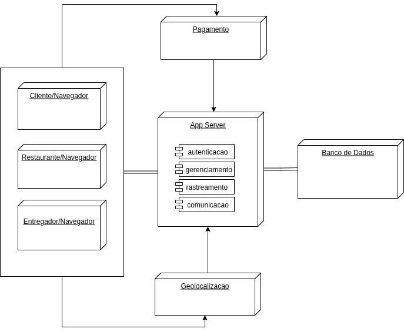

# **Visão de Implantação**

A Visão de Implantação do *PodePedirFCTE* apresenta a configuração física de hardware e software na qual o sistema será executado. O objetivo é demonstrar os **nós físicos**, **artefatos**, **componentes lógicos**, e **interconexões de rede** que sustentam o funcionamento do sistema em um ambiente de produção.

Uma representação visual completa está disponível no **Diagrama de Implantação** (Figura 1), localizado em:
**[Diagrama de Implantação](https://unbarqdsw2025-2-turma01.github.io/2025.2-T01-G7_PodePedirFCTE_Entrega_02/#/Modelagem/ModelagemEstatica/DiagramaDeImplantacao)**

Figura 1: Diagrama de Implantacao.

Fonte: Ana Joyce, Grabriela e João Filipe (2025)

### **1. Dispositivo do Usuário (\<device>Navegador Web)**

**Descrição:**
Computadores, smartphones ou tablets utilizados por três perfis do sistema:

* Cliente
* Restaurante
* Entregador

Cada um acessa o sistema via navegador, utilizando interfaces específicas conforme seu papel.

**Artefatos/Processos Implantados:**

* Interface Web (HTML, CSS, JavaScript)
* Lógicas de sessão
* Consumo das APIs REST do App Server

**Funções executadas:**

* Cliente: criação e acompanhamento de pedidos
* Restaurante: gestão de cardápio e pedidos
* Entregador: aceite e rastreamento de entregas

**Conexões:**

* Comunicação direta via **HTTP/HTTPS** com o App Server

### **2. Servidor de Aplicação (\<server> App Server)**

**Descrição:**
Servidor central que hospeda toda a lógica de negócio do PodePedirFCTE. Pode ser uma máquina dedicada, VM em nuvem ou um cluster escalável.

**Artefatos/Processos Implantados:**
Módulos internos do sistema, conforme representado no diagrama:

* **autenticacao** – login, registro e controle de acesso
* **gerenciamento** – gestão do fluxo de pedidos, cardápios e usuários
* **rastreamento** – atualização da localização do entregador e status do pedido
* **comunicacao** – troca de mensagens e notificações

Além disso, o servidor executa:

* API REST do backend
* Conectores de integração com Pagamento e Geolocalização

**Conexões:**

* TCP/IP seguro com o Banco de Dados
* HTTPS/API com serviços externos (Pagamento e Geolocalização)
* HTTPS com os navegadores dos usuários

### **3. Sistema de Banco de Dados (\<database> Banco de Dados)**

**Descrição:**
Servidor responsável pela persistência dos dados do sistema. Em produção, pode ser um serviço gerenciado (MySQL/PostgreSQL).

**Artefatos/Processos Implantados:**

* Esquema completo do PodePedir (usuários, restaurantes, pedidos, localização, histórico, pagamentos)
* Índices, tabelas e procedures (quando aplicável)

**Conexões:**

* Comunicação **TCP/IP** direta com o Servidor de Aplicação
* Apenas o App Server tem permissão de acesso

---

### **4. Serviço Externo de Pagamento (\<system> Pagamento)**

**Descrição:**
Sistema terceiro responsável por processar as transações financeiras dos pedidos.

**Funções:**

* Cobranças
* Autorização de pagamento
* Confirmação de transações

**Conexões:**

* Comunicação via **HTTPS/API** com o App Server

### **5. Serviço Externo de Geolocalização (\<system> Geolocalização)**

**Descrição:**
Serviço de terceiros utilizado para cálculos de rota, distância e obtenção de coordenadas.

**Artefatos/Processos:**

* APIs REST para latitude/longitude
* Cálculo de rotas entre restaurante – entregador – cliente

**Conexões:**

* HTTPS/API com o App Server

## **Interconexões de Rede**

A comunicação entre os nós segue o fluxo:

1. Dispositivos dos usuários → **App Server** (HTTP/HTTPS)
2. App Server → **Banco de Dados** (TCP/IP seguro)
3. App Server → **Serviço de Pagamento** (HTTPS)
4. App Server → **Serviço de Geolocalização** (HTTPS)

Toda comunicação sensível utiliza **criptografia TLS/HTTPS**.

## Quadro de Participações

| **Membro da equipe** | **Função** |
| :------------- | :--------- |
| [João Filipe](https://github.com/Joao151104) | Documentação da página |

## Referências
> LEITE, Rodrigo M. Curso de UML - Diagrama de Implantação. YouTube, 27 de maio de 2020. Disponível em: https://www.youtube.com/watch?v=DgERD0HgggQ. Acesso em: 22 set. 2025.

## Histórico de Versões

| **Data**       | **Versão** | **Descrição**                         | **Autor**                                      | **Revisor**                                      | **Data da Revisão** |
| :--------: | :----: | :-------------------------------- | :----------------------------------------: | :----------------------------------------: | :-------------: |
| 20/11/2025 |  `1.0`   | Criação inicial da Visão de Implantação. | [`@João Filipe`](https://github.com/Joao151104) | [`@Ana Clara`](https://github.com/anabborges) |   20/11/2025    |